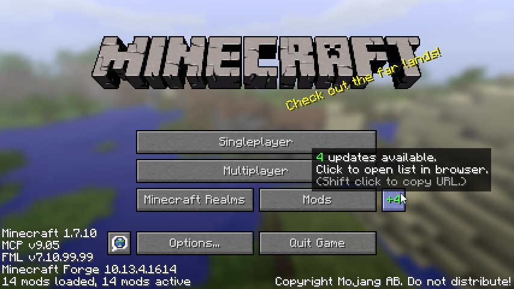
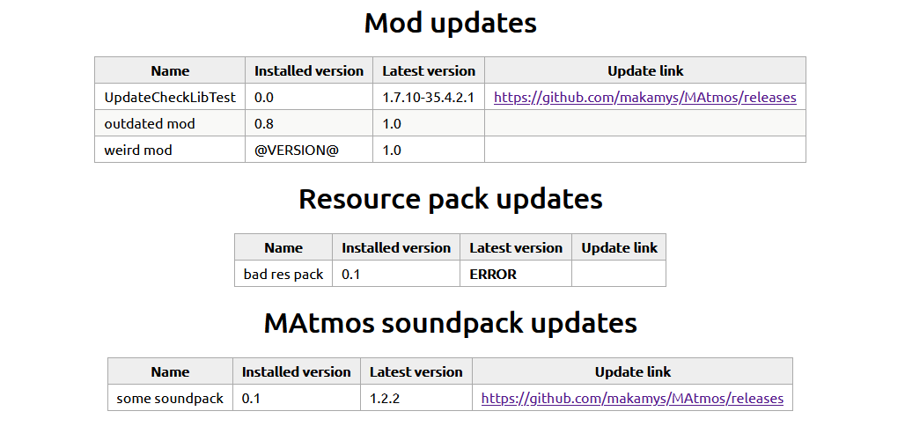

# UpdateCheck

This is a library module Minecraft mods can use to check for updates. When there are mods with updates available, a button will appear in the main menu.



Clicking this button will open a simple HTML file containing the results of the update check.



*Note: the results in the picture are dummy data provided by test cases, not real world results.*

You can also add update check tasks for non-mod *components* such as resource packs, or custom categories you define.

# Usage

Use `MCLibModules.updateCheckAPI`'s methods to register update check tasks before the post-init phase.

## Example
```java
static {
	MCLib.init();
}

@EventHandler
public void preInit(FMLPreInitializationEvent event) {
	MCLibModules.updateCheckAPI.submitModTask(MODID, "@UPDATE_URL@");
}
```

Here `@UPDATE_URL@` is a URL to a [Forge update JSON file](https://mcforge.readthedocs.io/en/latest/gettingstarted/autoupdate/) that you have to host somewhere, like GitHub.
